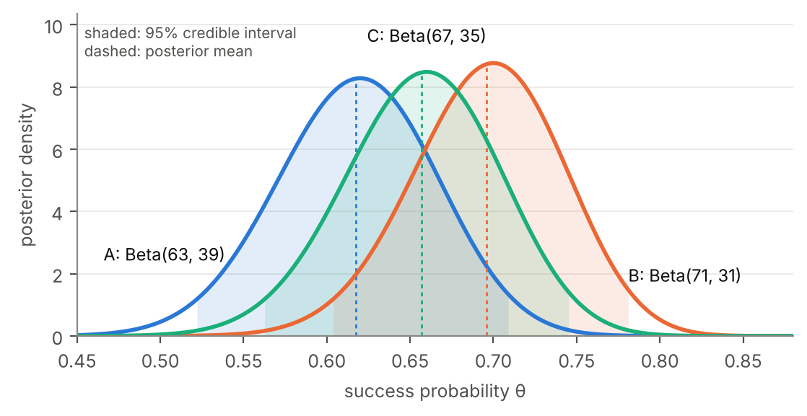

# Which Treatment Should We Choose?

MA 232 Bayesian Statistical Methods, Group Project 2. A Bayesian comparison of three treatments from simulated clinical-trial data.

**Group:** Aditya Singh (250003007), Hiransh Anand (250041018), Parth Pawar (250041030), Tirthanker Singh (250003081), Gulam Abbas (250041016).


| Treatment | Patients | Successes |
|---|---|---|
| A | 100 | 62 |
| B | 100 | 70 |
| C | 100 | 66 |

**Report:** [`report/report.pdf`](report/report.pdf) (7 pages).

## Result

With independent uniform priors, the posteriors are θ_A ~ Beta(63, 39), θ_B ~ Beta(71, 31) and θ_C ~ Beta(67, 35).

| | Posterior mean | 95% credible interval | P(best) |
|---|---|---|---|
| A | 0.6176 | 0.522 – 0.709 | 0.071 |
| B | 0.6961 | 0.604 – 0.781 | 0.681 |
| C | 0.6569 | 0.562 – 0.745 | 0.248 |

- P(θ_B > θ_A | data) = 0.882 and P(B is best) = 0.681, both computed **exactly** as fractions.
- Choosing B has the smallest expected loss: 1.28 percentage points of success rate, against 5.21 for C and 9.13 for A.
- B is chosen under all four priors tried: uniform, Jeffreys, Beta(2,2) and Beta(10,10).
- B versus C is not settled: P(θ_B > θ_C) = 0.726.

**Recommendation: treatment B**, with a further B-versus-C comparison if the decision has high stakes.



## How the exact probabilities work

The Beta parameters are whole numbers, so every density and CDF is a polynomial with rational coefficients. Then P(θ_B > θ_A) = ∫ f_B F_A, P(k best) = ∫ f_k ∏ F_j and E[max θ] are integrals of polynomials, so each has an exact rational value. `src/treatment_bayes/exact.py` computes them in exact fraction arithmetic.

## Run it

```bash
pip install -r requirements.txt
python scripts/run_analysis.py    # all numbers -> results/results.json and report/numbers.tex
python scripts/make_figures.py    # figures/*.pdf
python checks/run_checks.py       # independent verification
```

To rebuild the report PDF (needs a TeX distribution with `latexmk`):

```bash
make            # analysis, figures and report
make check      # the checks only
```

Python 3.10 or newer. Tested with Python 3.13.16, NumPy 2.5.3, SciPy 1.18.1, Matplotlib 3.11.2 and TeX Live 2023.

## Layout

```
data/trial.csv               the project table
src/treatment_bayes/
  exact.py                   exact rational posteriors: P(X > Y), P(best), E[max], P(X - Y > d)
  posterior.py               Beta posteriors for any prior; mean, median, mode, credible intervals
  compare.py                 the same comparisons by quadrature (works for non-integer priors)
  decision.py                Bayes actions under opportunity loss and zero-one loss
  predictive.py              beta-binomial predictive for future patients
  classical.py               Wald intervals and z-test, for comparison
  approx.py                  Module 5 Lindley and Tierney-Kadane approximations
  montecarlo.py              seeded posterior simulation with standard errors
scripts/run_analysis.py      computes everything; writes results and LaTeX macros
scripts/make_figures.py      draws the four report figures
checks/                      independent checks (run_checks.py runs them all)
report/report.tex            report source; numbers come from report/numbers.tex
report/authors.tex           group members' names and roll numbers
```

## Verification

No result in the report is typed by hand: `scripts/run_analysis.py` writes them all into `report/numbers.tex`, which the report reads. `checks/` then verifies each result by a different route:

- **Exact results:** a second exact method, either an independent finite-sum formula for P(X > Y) or the binomial-tail form of the Beta CDF.
- **Floating-point results:** SciPy quadrature.
- **Simulation:** seeded Monte Carlo, judged by its standard error.
- **The posterior itself:** Bayes' theorem evaluated numerically on a grid.
- **Module 5 code:** reproduces the course's worked example (Lindley 1.9965, Tierney–Kadane 1.995138).
- **Report audit:** recomputes every printed number with independent code.
